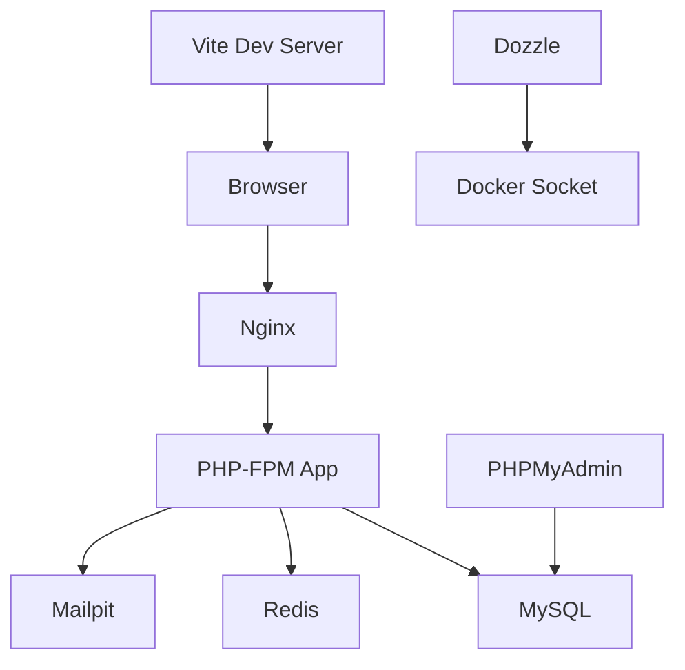

# PROJECT OVERVIEW

## 📋 Table of Contents

- [Project Description](#project-description)
- [Tech Stack](#tech-stack)
- [Architecture Overview](#architecture-overview)
- [Docker Services](#docker-services)
- [Backend Architecture](#backend-architecture)
- [Frontend Architecture](#frontend-architecture)
- [Multilanguage Support](#multilanguage-support)
- [API Documentation (Scribe)](#api-documentation-scribe)
- [Authentication & Authorization](#authentication--authorization)
- [Development Workflow](#development-workflow)
- [Environment Configuration](#environment-configuration)
- [Deployment](#deployment)
- [Assumptions](#assumptions)
- [Extra Improvements & Enhancements](#extra-improvements--enhancements)
- [Code Quality & Standards](#code-quality--standards)


## 🚀 Quickstart (TL;DR)

```bash
# Copy envs
cp .env.example .env

# Boot the stack
docker compose up -d --build

# Backend deps + key + migrate/seed (inside app container)
docker compose exec app composer install
docker compose exec app php artisan key:generate
docker compose exec app php artisan migrate --seed

# Frontend deps (host or node container)
npm install
npm run dev

# Open
# - API/Laravel: http://localhost:8000
# - Frontend (Vite dev): http://localhost:5173
# - Docs (Scribe): http://localhost:8000/docs
# - phpMyAdmin: http://localhost:8080
```

**Defaults**
- Auth: Laravel Sanctum; use seeded admin/user accounts or create via API.
- Language header required for API calls: `language: en` or `language: bn`.

---
## 🎯 Project Description

MCQ Exam Evaluation System — a modern Laravel 12 + Vue 3 platform for creating, practicing, and evaluating multiple-choice questions. It is fully containerized, multilingual (English/Bangla), and ships with production-ready auth, admin dashboards, and documented APIs.

**Client-Facing Highlights**
- **Admin dashboard:** Live stats (questions, users, submissions, accuracy), quick links to profile/password, and question management.
- **Question builder:** Create/update MCQs with single/multiple answers, marks, and publishing controls.
- **MCQ practice:** Learners attempt questions, get instant correctness, and see obtained marks.
- **Localization:** Seamless language switching (EN/BN) across UI and APIs.
- **Access control:** Role-gated navigation and protected routes.

**Engineering Features**
- ✅ RESTful API with Scribe documentation
- ✅ Laravel Sanctum authentication
- ✅ DTO + Action patterns for clean domain logic
- ✅ Vue 3 (Composition API) + Tailwind UI
- ✅ VForm for resilient form UX
- ✅ Dockerized stack (Nginx, PHP-FPM, MySQL, Redis, Vite, Mailpit, Dozzle, phpMyAdmin)

---

## 🛠 Tech Stack

### Backend
- **Framework:** Laravel 12 (PHP 8.4)
- **Authentication:** Laravel Sanctum
- **Database:** MySQL 8.0
- **Cache:** Redis 7
- **Image Processing:** Intervention Image
- **API Documentation:** Scribe
- **Background Jobs:** Laravel Horizon
- **Real-time:** Laravel Reverb
- **Testing:** PHPUnit, Laravel Debugbar

### Frontend
- **Framework:** Vue 3 (Composition API)
- **Build Tool:** Vite
- **Styling:** Tailwind CSS 4 with @tailwindcss/forms
- **HTTP Client:** Axios
- **Form Handling:** VForm
- **Internationalization:** laravel-vue-i18n
- **State Management:** Pinia
- **Date/Time:** Day.js, date-fns
- **Event Bus:** Mitt

### DevOps & Tools
- **Containerization:** Docker & Docker Compose
- **Web Server:** Nginx (Alpine)
- **Node.js:** Version 22 (Alpine)
- **Mail Testing:** Mailpit
- **Log Monitoring:** Dozzle
- **Database GUI:** phpMyAdmin

---

## 🏗 Architecture Overview

### Design Patterns

#### 1. **DTO (Data Transfer Object) Pattern**
DTOs are used to transfer data between layers, ensuring type safety and validation.

```php
// Example: UpdateProfileDTO
class UpdateProfileDTO
{
    public function __construct(
        public string $full_name,
        public ?string $language = null,
        public ?string $gender = null,
        public ?string $password = null,
        public ?string $avatar = null,
    ) {}
}
```

#### 2. **Action Pattern**
Business logic is encapsulated in Action classes, keeping controllers thin.

```php
// Example: UpdateProfileAction
class UpdateProfileAction
{
    public function execute(User $user, UpdateProfileDTO $dto): User
    {
        // Business logic here
        return $user;
    }
}
```

#### 3. **Repository Pattern**
Data access logic is abstracted through repositories (used selectively).

#### 4. **Service Pattern**
Complex operations are handled by service classes.

### Project Structure

```
.
├── app/
│   ├── Actions/              # Business logic actions
│   ├── DataTransferObjects/  # DTOs for data transfer
│   ├── Enums/               # Application enums
│   ├── Http/
│   │   ├── Controllers/     # API controllers
│   │   ├── Middleware/      # Custom middleware
│   │   ├── Requests/        # Form request validation
│   │   └── Resources/       # API resources
│   ├── Models/              # Eloquent models
│   └── Traits/              # Reusable traits
├── database/
│   ├── migrations/          # Database migrations
│   └── seeders/             # Database seeders
├── resources/
│   ├── js/                  # Vue.js application
│   │   ├── components/      # Vue components
│   │   ├── composables/     # Composition API composables
│   │   ├── layouts/         # Layout components
│   │   ├── pages/           # Page components
│   │   ├── router/          # Vue Router configuration
│   │   ├── stores/          # Pinia stores
│   │   └── utils/           # Utility functions
│   ├── lang/                # Translation files
│   └── views/               # Blade templates
├── routes/
│   ├── api.php              # API routes
│   ├── api/v1/              # Versioned API routes
│   └── web.php              # Web routes
└── .docker/                 # Docker configuration files
```

---

## 🐳 Docker Services

### Service Architecture



### Services Configuration

| Service | Container Name | Purpose | Ports | Health Check |
|---------|---------------|---------|-------|--------------|
| **nginx** | crud_nginx | Web server (serves Laravel public/) | 8000:80 | - |
| **app** | crud_app | PHP-FPM 8.4 runtime | 9000 (internal) | - |
| **mysql** | crud_mysql | MySQL 8.0 database | 3307:3306 | mysqladmin ping |
| **redis** | crud_redis | Cache & session store | 6379 (internal) | - |
| **node** | crud_node | Vite dev server | 5173:5173 | - |
| **phpmyadmin** | crud_phpmyadmin | Database management UI | 8080:80 | - |
| **mailpit** | crud_mailpit | Email testing (SMTP + Web UI) | 8025:8025, 1025:1025 | - |
| **dozzle** | crud_dozzle | Real-time container logs viewer | 8890:8080 | - |

### Access Points

- **Application (Laravel):** http://localhost:8000
- **Frontend Dev Server (Vite):** http://localhost:5173
- **phpMyAdmin:** http://localhost:8080
- **Mailpit Web UI:** http://localhost:8025
- **Dozzle (Logs):** http://localhost:8890
- **API Documentation:** http://localhost:8000/docs
- **MySQL Direct Connection:** localhost:3307

### Docker Commands

```bash
# Start all services
docker compose up -d

# View logs
docker compose logs -f [service_name]

# Stop all services
docker compose down

# Rebuild services
docker compose up -d --build

# Execute commands in app container
docker compose exec app bash
docker compose exec app php artisan migrate
docker compose exec app php artisan optimize:clear

# Access MySQL CLI
docker compose exec mysql mysql -u crud_user -psecret crud_db
```

### Volume Management

- **mysql_data:** Persistent MySQL data
- **redis_data:** Persistent Redis data
- **node_modules:** Cached Node.js dependencies

---

## 🔧 Backend Architecture

### API Structure

All API routes are versioned and prefixed with `/api/v1/`:

```
/api/v1/
├── admin/              # Admin routes
│   ├── login          # POST - User login
│   ├── register       # POST - User registration
│   ├── logout         # POST - User logout (auth required)
│   ├── user-details   # GET - Get authenticated user (auth required)
│   ├── update-profile # PUT - Update profile with avatar (auth required)
│   └── change-password # PUT - Change password (auth required)
├── enums/             # Enum endpoints
│   └── gender         # GET - Get gender options
└── health             # GET - Health check endpoint
```

### Route Organization

```php
// routes/api.php
Route::prefix('v1')->group(function () {
    // Health check
    Route::get('health', [HealthController::class, 'health']);
    
    // Enums
    Route::prefix('enums')->group(function () {
        Route::get('gender', [EnumController::class, 'gender']);
    });
    
    // Admin routes
    Route::prefix('admin')->group(function () {
        // Public routes (without auth)
        require __DIR__ . '/api/v1/admin/without_authentication.php';
        
        // Protected routes (with auth)
        require __DIR__ . '/api/v1/admin/auth.php';
    });
});
```

### Request Validation

All requests use Form Request classes with custom validation rules:

```php
// app/Http/Requests/Api/Auth/UpdateProfileRequest.php
public function rules(): array
{
    return [
        'full_name' => 'required|string|min:2|max:255',
        'password' => 'nullable|string|min:8|confirmed',
        'language' => 'nullable|string|in:' . implode(',', array_column(AppLanguageEnum::cases(), 'value')),
        'gender' => 'nullable|string|in:' . implode(',', array_column(UserGenderEnum::cases(), 'value')),
        'avatar' => 'nullable|image|mimes:jpeg,png,jpg|max:20480',
    ];
}

// Scribe documentation support
public function bodyParameters(): array
{
    return [
        'full_name' => [
            'description' => 'Full name of the user',
            'example' => 'John Doe',
        ],
        // ... more parameters
    ];
}
```

### Response Format

All API responses follow a consistent format using helper functions:

```php
// Success response
success_response($data, $is_data = true, $message = 'success')
// Returns:
{
    "success": true,
    "message": "success",
    "data": { ... }
}

// Error response
error_response($message, $status_code = 400, $data = [])
// Returns:
{
    "success": false,
    "message": "error_message",
    "data": []
}
```

### File Upload Handling

The `UploadAble` trait provides consistent file upload functionality:

```php
trait UploadAble
{
    protected function uploadFile(
        UploadedFile $file,
        string $directory,
        string $disk = 'public',
        ?string $filename = null,
        array $options = []
    ): string
    {
        // Handles image resizing, quality optimization
        // Returns stored file path
    }
}
```

### Enums

Application uses PHP 8.4 enums for type safety:

```php
// AppLanguageEnum
enum AppLanguageEnum: string
{
    case EN = 'en';
    case BN = 'bn';
    
    public function label(): string
    {
        return match ($this) {
            self::EN => 'English',
            self::BN => 'Bangla',
        };
    }
}

// UserGenderEnum
enum UserGenderEnum: string
{
    case MALE = 'male';
    case FEMALE = 'female';
    case OTHER = 'other';
}
```

---

## 🎨 Frontend Architecture

### Vue 3 Structure

The frontend uses Vue 3 with Composition API and script setup syntax:

```vue
<script setup>
import { ref, onMounted } from 'vue';
import { useI18n } from 'vue-i18n';

const { t } = useI18n();
const data = ref([]);

onMounted(async () => {
    // Component logic
});
</script>

<template>
    <!-- Template -->
</template>
```

### Form Handling with VForm

VForm simplifies form submissions and validation:

```vue
<script setup>
import Form from 'vform';

const form = new Form({
    full_name: '',
    email: '',
    password: '',
    password_confirmation: ''
});

const submit = async () => {
    try {
        const response = await form.post('/v1/admin/register');
        // Handle success
    } catch (error) {
        // Errors are automatically handled by VForm
    }
};
</script>
```

**VForm Features:**
- Automatic error handling
- Built-in loading states
- File upload support
- Error display per field
- Automatic form reset

### Component Library

#### 1. **TextInput Component**
Reusable input with built-in validation:

```vue
<TextInput
    v-model="form.email"
    name="email"
    type="email"
    :label="t('email')"
    :placeholder="t('enter_email')"
    :required="true"
    :error="form.errors.get('email')"
/>
```

**Props:**
- `required`, `minLength`, `maxLength`
- `email`, `password`, `number`
- `error` - External error message
- Auto-validates on blur

#### 2. **SingleSelect Component**
Dropdown with API endpoint support:

```vue
<SingleSelect
    v-model="form.gender"
    name="gender"
    :label="t('gender')"
    :placeholder="t('select_gender')"
    :options="genderOptions"
    :endpoint="'v1/enums/gender'"
    :searchable="false"
/>
```

**Features:**
- Static options or API endpoint
- Searchable dropdown
- Disabled state
- Auto-fetches data from API

### Axios Configuration

Custom axios instance with interceptors:

```javascript
// resources/js/axios.js
axios.defaults.baseURL = '/api';
axios.defaults.headers.common = { Accept: 'application/json' };

// Request interceptor - adds language header
axios.interceptors.request.use(config => {
    const lang = localStorage.getItem('language') || 'en';
    config.headers['language'] = lang;
    return config;
});

// Response interceptor - handles errors globally
axios.interceptors.response.use(
    response => response,
    error => {
        // Global error handling
        notify.error(trans(error.response?.data?.message || 'error'));
        return Promise.reject(error);
    }
);
```

### State Management (Pinia)

```javascript
// stores/auth.js
import { defineStore } from 'pinia';

export const useAuthStore = defineStore('auth', {
    state: () => ({
        user: null,
        token: localStorage.getItem('token') || null,
    }),
    
    actions: {
        async login(credentials) {
            const response = await axios.post('/v1/admin/login', credentials);
            this.setAuth(response.data.data);
        },
        
        setAuth(data) {
            this.user = data.user;
            this.token = data.access_token;
            localStorage.setItem('token', data.access_token);
            axios.defaults.headers.common['Authorization'] = `Bearer ${data.access_token}`;
        },
        
        logout() {
            this.user = null;
            this.token = null;
            localStorage.removeItem('token');
            delete axios.defaults.headers.common['Authorization'];
        }
    }
});
```

---

## 🌍 Multilanguage Support

### Backend Implementation

#### 1. **Language Middleware**

All API requests MUST include a `language` header:

```php
// app/Http/Middleware/LanguageMiddleware.php
class LanguageMiddleware
{
    public function handle(Request $request, Closure $next)
    {
        $lang = $request->header('language');
        
        if (!$request->hasHeader('language') || empty($lang)) {
            return response()->json([
                'success' => false,
                'message' => 'missing_required_language_in_header',
            ], 422);
        }
        
        app()->singleton('language', fn() => $lang);
        app()->setLocale($lang);
        
        return $next($request);
    }
}
```

#### 2. **Translation Files**

```
resources/lang/
├── en.json          # English translations
└── bn.json          # Bangla translations
```

Example translations:

```json
// en.json
{
    "login_successful": "Login successful",
    "invalid_credentials": "Invalid email or password",
    "field_input_is_missing": "This field is required"
}

// bn.json
{
    "login_successful": "লগইন সফল হয়েছে",
    "invalid_credentials": "ইমেইল বা পাসওয়ার্ড ভুল",
    "field_input_is_missing": "এই ফিল্ডটি আবশ্যক"
}
```

### Frontend Implementation

#### 1. **laravel-vue-i18n**

```javascript
// main.js
import { i18nVue } from 'laravel-vue-i18n';

app.use(i18nVue, {
    resolve: async lang => {
        const langs = import.meta.glob('../../lang/*.json');
        return await langs[`../../lang/${lang}.json`]();
    },
});
```

#### 2. **Usage in Components**

```vue
<script setup>
import { trans } from 'laravel-vue-i18n';

const message = trans('login_successful');
</script>

<template>
    <h1>{{ trans('welcome') }}</h1>
    <p>{{ $t('description') }}</p>
</template>
```

#### 3. **Language Switching**

```javascript
// composables/useLanguage.js
export function useLanguage() {
    const currentLanguage = ref(localStorage.getItem('language') || 'en');
    
    const changeLanguage = (lang) => {
        currentLanguage.value = lang;
        localStorage.setItem('language', lang);
        // Axios interceptor automatically adds language header
        location.reload(); // Reload to apply translations
    };
    
    return { currentLanguage, changeLanguage };
}
```

### Supported Languages

| Code | Language | Label |
|------|----------|-------|
| `en` | English | English |
| `bn` | Bangla | বাংলা |

**Adding New Languages:**

1. Add enum case in `AppLanguageEnum.php`
2. Create translation file in `resources/lang/`
3. Update language switcher UI
4. Test all translations

---

## 📚 API Documentation (Scribe)

### Overview

Scribe automatically generates beautiful, interactive API documentation from your code annotations.

**Access:** http://localhost:8000/docs

### Configuration

```php
// config/scribe.php
return [
    'title' => config('app.name') . ' API Documentation',
    'description' => 'This documentation is for general API routes.',
    'base_url' => config('app.url'),
    
    'type' => 'laravel', // Generates as Blade view
    'theme' => 'elements', // Modern theme
    
    'routes' => [
        [
            'match' => [
                'prefixes' => ['api/*'],
                'domains' => ['*'],
            ],
            'exclude' => [
                'api/mobile/*', // Exclude mobile API
            ],
        ],
    ],
    
    'auth' => [
        'enabled' => true,
        'in' => 'bearer', // Bearer token authentication
    ],
];
```

### Documentation Annotations

#### Controller Level

```php
/**
 * @group Auth
 */
class AuthController extends Controller
{
    /**
     * Login
     * 
     * Authenticate user with email and password, returns access token.
     * 
     * @unauthenticated
     * 
     * @response 200 scenario="Successful login" {
     *   "success": true,
     *   "message": "success",
     *   "data": {
     *     "message": "login_successful",
     *     "access_token": "1|token...",
     *     "token_type": "Bearer",
     *     "user": { ... }
     *   }
     * }
     * 
     * @response 401 scenario="Invalid credentials" {
     *   "success": false,
     *   "message": "invalid_credentials"
     * }
     */
    public function login(LoginRequest $request) { }
}
```

#### Request Level (Form Requests)

```php
class UpdateProfileRequest extends FormRequest
{
    public function bodyParameters(): array
    {
        return [
            'full_name' => [
                'description' => 'Full name of the user',
                'example' => 'John Doe',
            ],
            'avatar' => [
                'description' => 'Avatar image (JPEG, PNG - max 20MB)',
                'type' => 'file', // Important for file uploads
            ],
        ];
    }
}
```

### Generating Documentation

```bash
# Generate API documentation
docker compose exec app php artisan scribe:generate

# Or use alias (if configured)
paapidocs
```

**Generated Files:**
- `resources/views/scribe/index.blade.php` - Main documentation view
- `.scribe/` - Source markdown files (gitignored)

### Best Practices

1. **Always document:**
   - Request parameters
   - Response formats
   - Error scenarios
   - Authentication requirements

2. **Use @group for organization:**
   - Auth
   - Tasks
   - Enums
   - Admin

3. **File uploads require `type: 'file'`:**
   ```php
   'avatar' => [
       'description' => 'User avatar',
       'type' => 'file',
   ]
   ```

4. **Mark public endpoints as `@unauthenticated`**

5. **Provide realistic examples**

---

## 🔐 Authentication & Authorization

### Laravel Sanctum

Token-based authentication using Laravel Sanctum:

#### 1. **Configuration**

```php
// config/sanctum.php
'expiration' => null, // Tokens don't expire
'middleware' => [
    'verify_csrf_token' => false,
    'encrypt_cookies' => false,
],
```

#### 2. **Google OAuth Authentication**

The system supports Google OAuth for seamless user registration and login:

**Features:**
- One-click Google sign-in
- Auto-registration for new users
- Avatar import from Google profile
- Automatic student role assignment

**Implementation:**

```php
// app/Actions/Auth/GoogleLoginAction.php
public function execute(GoogleLoginDTO $dto): array
{
    // Get user from Google OAuth token
    $googleUser = Socialite::driver('google')->stateless()->userFromToken($dto->token);
    
    $email = Str::lower($googleUser->getEmail() ?? '');
    
    // Find or create user
    $user = User::where('email', $email)->first();
    
    if (!$user) {
        // Auto-register new user
        $user = User::create([
            'full_name' => $googleUser->getName(),
            'email' => $email,
            'language' => $dto->language ?? 'en',
            'avatar' => $googleUser->getAvatar(),
            'role' => UserRoleEnum::STUDENT->value,
        ]);
    }
    
    // Generate Sanctum token
    $token = $user->createToken('google-auth')->plainTextToken;
    
    return [
        'success' => true,
        'access_token' => $token,
        'user' => $user,
    ];
}
```

**Frontend Integration:**

```javascript
// Google Sign-In Button
const handleGoogleLogin = async (googleToken) => {
    try {
        const response = await axios.post('/v1/admin/google-login', {
            token: googleToken,
            language: localStorage.getItem('language') || 'en'
        });
        
        const { access_token, user } = response.data.data;
        
        // Store token
        localStorage.setItem('token', access_token);
        axios.defaults.headers.common['Authorization'] = `Bearer ${access_token}`;
        
        // Navigate to dashboard
        router.push('/dashboard');
    } catch (error) {
        // Handle error (invalid token, etc.)
    }
};
```

**Configuration (.env):**

```env
GOOGLE_CLIENT_ID=your-google-client-id
GOOGLE_CLIENT_SECRET=your-google-client-secret
GOOGLE_REDIRECT_URI=http://localhost:8000/auth/google/callback
```

**Benefits:**
- No password management for users
- Faster onboarding
- Reduced friction in registration
- Trust via Google identity

#### 3. **Traditional Authentication Flow**

```php
// Login
public function login(LoginRequest $request)
{
    $credentials = $request->only('email', 'password');
    
    if (!Auth::attempt($credentials)) {
        return error_response('invalid_credentials', 401);
    }
    
    $user = Auth::user();
    $token = $user->createToken('admin')->plainTextToken;
    
    return success_response([
        'access_token' => $token,
        'token_type' => 'Bearer',
        'user' => new UserResource($user),
    ]);
}

// Logout
public function logout(Request $request)
{
    $request->user()->currentAccessToken()->delete();
    return success_response([], false, 'logged_out');
}
```

#### 3. **Protected Routes**

```php
// routes/api/v1/admin/auth.php
Route::middleware('auth:sanctum')->group(function () {
    Route::post('logout', [AuthController::class, 'logout'])->name('logout');
    Route::get('user-details', [AuthController::class, 'me'])->name('me');
    Route::put('update-profile', [AuthController::class, 'updateProfile'])->name('update-profile');
    Route::put('change-password', [AuthController::class, 'changePassword'])->name('change-password');
});
```

#### 4. **Frontend Integration**

```javascript
// Login
const login = async (credentials) => {
    const response = await form.post('/v1/admin/login');
    const { access_token, user } = response.data.data;
    
    // Store token
    localStorage.setItem('token', access_token);
    
    // Set axios default header
    axios.defaults.headers.common['Authorization'] = `Bearer ${access_token}`;
    
    // Navigate to dashboard
    router.push('/dashboard');
};

// Add token to all requests
axios.interceptors.request.use(config => {
    const token = localStorage.getItem('token');
    if (token) {
        config.headers.Authorization = `Bearer ${token}`;
    }
    return config;
});
```

### Route Protection

Frontend routes are protected using Vue Router navigation guards:

```javascript
// router/index.js
router.beforeEach((to, from, next) => {
    const token = localStorage.getItem('token');
    const requiresAuth = to.matched.some(record => record.meta.requiresAuth);
    
    if (requiresAuth && !token) {
        next('/login');
    } else if (to.path === '/login' && token) {
        next('/dashboard');
    } else {
        next();
    }
});
```

---

## 🎓 MCQ Evaluation Logic

### Overview

The system uses a strict evaluation algorithm for MCQ submissions:

**Evaluation Rules:**
1. **Exact Match Required:** All selected options must be correct AND all correct options must be selected
2. **No Partial Credit:** Either full marks or zero marks
3. **Single Submission:** Each question can only be answered once
4. **Published Only:** Only published questions are evaluated
5. **Option Validation:** Only options belonging to the question are counted

### Evaluation Algorithm

```php
// app/Http/Controllers/Api/Student/QuestionController.php
public function submit(SubmitAnswersRequest $request): JsonResponse
{
    $responses = collect($request->validated('responses'));
    $userId = $request->user()->id;
    
    // Fetch questions with their correct answers
    $questions = Question::query()
        ->whereIn('id', $responses->pluck('question_id'))
        ->where('published', true)
        ->with('options:id,question_id,is_correct')
        ->get()
        ->keyBy('id');
    
    $totalMarks = 0;
    $obtainedMarks = 0;
    $correctCount = 0;
    
    foreach ($responses as $response) {
        $questionId = $response['question_id'];
        $selectedOptionIds = collect($response['option_ids'])->unique()->values();
        $question = $questions->get($questionId);
        
        // Get correct answer(s)
        $correctOptionIds = $question->options
            ->where('is_correct', true)
            ->pluck('id')
            ->values();
        
        $totalMarks += (float) $question->mark;
        
        // Award marks only if:
        // 1. Student selected at least one option
        // 2. All selected options are correct
        // 3. All correct options were selected (exact match)
        $isCorrect = $correctOptionIds->isNotEmpty()
            && $selectedOptionIds->isNotEmpty()
            && $selectedOptionIds->diff($correctOptionIds)->isEmpty()
            && $correctOptionIds->diff($selectedOptionIds)->isEmpty();
        
        if ($isCorrect) {
            $obtainedMarks += (float) $question->mark;
            $correctCount++;
        }
    }
    
    // Store submission record
    QuestionSubmission::create([
        'user_id' => $userId,
        'total_marks' => $totalMarks,
        'obtained_marks' => $obtainedMarks,
        'questions_answered' => $responses->count(),
        'correct_answers' => $correctCount,
    ]);
    
    return success_response([
        'total_marks' => $totalMarks,
        'obtained_marks' => $obtainedMarks,
        'questions_answered' => $responses->count(),
        'correct_answers' => $correctCount,
    ]);
}
```

### Scoring Examples

#### Example 1: Single Correct Answer
```json
{
  "question": "What is 2 + 2?",
  "mark": 5,
  "options": [
    {"id": 1, "text": "3", "is_correct": false},
    {"id": 2, "text": "4", "is_correct": true},
    {"id": 3, "text": "5", "is_correct": false}
  ]
}

// Submission
{
  "question_id": 1,
  "option_ids": [2]
}

// Result: ✅ Correct (5 marks)
// Reason: Selected option 2 (correct), which matches all correct answers
```

#### Example 2: Multiple Correct Answers
```json
{
  "question": "Which are programming languages?",
  "mark": 10,
  "options": [
    {"id": 1, "text": "Python", "is_correct": true},
    {"id": 2, "text": "HTML", "is_correct": false},
    {"id": 3, "text": "JavaScript", "is_correct": true},
    {"id": 4, "text": "CSS", "is_correct": false}
  ]
}

// Case A: All correct selected
{
  "question_id": 2,
  "option_ids": [1, 3]
}
// Result: ✅ Correct (10 marks)

// Case B: Only one correct selected
{
  "question_id": 2,
  "option_ids": [1]
}
// Result: ❌ Wrong (0 marks)
// Reason: Missing option 3 (JavaScript)

// Case C: All correct + one wrong selected
{
  "question_id": 2,
  "option_ids": [1, 2, 3]
}
// Result: ❌ Wrong (0 marks)
// Reason: Option 2 (HTML) is incorrect
```

#### Example 3: Invalid Submissions
```json
// Case A: No options selected
{
  "question_id": 3,
  "option_ids": []
}
// Result: ❌ Wrong (0 marks)
// Reason: No options selected

// Case B: Invalid option ID
{
  "question_id": 3,
  "option_ids": [999]
}
// Result: ❌ Wrong (0 marks)
// Reason: Option doesn't belong to this question
```

### Submission Response Format

```json
{
  "success": true,
  "message": "success",
  "data": {
    "total_marks": 25,
    "obtained_marks": 15,
    "questions_answered": 5,
    "correct_answers": 3,
    "details": [
      {
        "question_id": 1,
        "mark": 5,
        "selected_option_ids": [2],
        "correct_option_ids": [2],
        "is_correct": true
      },
      {
        "question_id": 2,
        "mark": 10,
        "selected_option_ids": [1],
        "correct_option_ids": [1, 3],
        "is_correct": false
      }
    ]
  }
}
```

### Duplicate Submission Prevention

```php
// Check if questions already submitted
$alreadySubmitted = QuestionSubmissionAnswer::query()
    ->where('user_id', $userId)
    ->whereIn('question_id', $questionIds)
    ->pluck('question_id')
    ->all();

if (!empty($alreadySubmitted)) {
    return error_response(__('already_submitted'), 422);
}
```

**Error Response:**
```json
{
  "success": false,
  "message": "already_submitted",
  "data": []
}
```

### Database Schema

**question_submissions** table (session-level summary):
```php
Schema::create('question_submissions', function (Blueprint $table) {
    $table->id();
    $table->foreignId('user_id')->constrained()->cascadeOnDelete();
    $table->decimal('total_marks', 8, 2);
    $table->decimal('obtained_marks', 8, 2);
    $table->integer('questions_answered');
    $table->integer('correct_answers');
    $table->timestamps();
});
```

**question_submission_answers** table (per-question details):
```php
Schema::create('question_submission_answers', function (Blueprint $table) {
    $table->id();
    $table->foreignId('user_id')->constrained()->cascadeOnDelete();
    $table->foreignId('question_id')->constrained()->cascadeOnDelete();
    $table->json('selected_option_ids');
    $table->json('correct_option_ids');
    $table->decimal('mark', 8, 2);
    $table->decimal('obtained_marks', 8, 2);
    $table->boolean('is_correct');
    $table->timestamps();
    
    // Prevent duplicate submissions
    $table->unique(['user_id', 'question_id']);
});
```

### Frontend Submission Example

```javascript
// Submit answers
const submitAnswers = async () => {
    try {
        const response = await axios.post('/v1/student/questions/submit', {
            responses: [
                {
                    question_id: 1,
                    option_ids: [2] // Single answer
                },
                {
                    question_id: 2,
                    option_ids: [1, 3] // Multiple answers
                }
            ]
        });
        
        const result = response.data.data;
        
        console.log(`Score: ${result.obtained_marks}/${result.total_marks}`);
        console.log(`Correct: ${result.correct_answers}/${result.questions_answered}`);
        
        // Show detailed results
        result.details.forEach(detail => {
            if (detail.is_correct) {
                console.log(`✅ Question ${detail.question_id}: Correct (+${detail.mark} marks)`);
            } else {
                console.log(`❌ Question ${detail.question_id}: Wrong (0 marks)`);
                console.log(`   Selected: [${detail.selected_option_ids}]`);
                console.log(`   Correct: [${detail.correct_option_ids}]`);
            }
        });
    } catch (error) {
        if (error.response?.data?.message === 'already_submitted') {
            alert('You have already answered these questions!');
        }
    }
};
```

### Key Features

✅ **Strict Evaluation** - No partial credit, exact match required
✅ **Duplicate Prevention** - Each question answered only once
✅ **Instant Feedback** - Immediate results with detailed breakdown
✅ **Immutable Submissions** - Cannot edit after submission
✅ **Comprehensive Tracking** - Both summary and per-question records
✅ **Validation** - Only valid options from published questions accepted

---

## 💻 Development Workflow

### Initial Setup

```bash
# 1. Clone repository
git clone <repository-url>
cd simple-crud-vue

# 2. Copy environment file
cp .env.example .env

# 3. Start Docker services
docker compose up -d

# 4. Install PHP dependencies
docker compose exec app composer install

# 5. Generate application key
docker compose exec app php artisan key:generate

# 6. Run migrations
docker compose exec app php artisan migrate

# 7. Seed database (optional)
docker compose exec app php artisan db:seed

# 8. Install Node dependencies (runs automatically in node container)
# Or manually: docker compose exec node npm install

# 9. Generate API documentation
docker compose exec app php artisan scribe:generate
```

### Daily Development

```bash
# Start services
docker compose up -d

# View logs
docker compose logs -f app
docker compose logs -f node

# Access application shell
docker compose exec app bash

# Run artisan commands
docker compose exec app php artisan migrate
docker compose exec app php artisan optimize:clear
docker compose exec app php artisan route:list

# Run tests
docker compose exec app php artisan test

# Stop services
docker compose down
```

### Database Management

```bash
# Create migration
docker compose exec app php artisan make:migration create_posts_table

# Run migrations
docker compose exec app php artisan migrate

# Rollback migrations
docker compose exec app php artisan migrate:rollback

# Fresh migration with seeding
docker compose exec app php artisan migrate:fresh --seed

# Access MySQL CLI
docker compose exec mysql mysql -u crud_user -psecret crud_db

# Or use phpMyAdmin
# http://localhost:8080
```

### Frontend Development

```bash
# Node container runs Vite automatically
# Access at: http://localhost:5173

# Rebuild node modules
docker compose exec node npm install

# Build for production
docker compose exec node npm run build

# Clear Vite cache
docker compose exec node rm -rf node_modules/.vite
```

### Debugging

#### Backend
- **Laravel Debugbar:** Enabled in development
- **Logs:** `storage/logs/laravel.log`
- **Query Log:** Enable in `.env`: `DB_LOG=true`

#### Frontend
- **Vue DevTools:** Install browser extension
- **Console Logs:** Check browser console
- **Network Tab:** Monitor API requests

#### Container Logs
- **Dozzle:** http://localhost:8890 (visual log viewer)
- **Docker logs:** `docker compose logs -f [service]`

### Code Quality

```bash
# PHP Code Style (if configured)
docker compose exec app ./vendor/bin/pint

# PHP Static Analysis (if configured)
docker compose exec app ./vendor/bin/phpstan analyse

# Frontend Linting
docker compose exec node npm run lint
```

---

## ⚙️ Environment Configuration

### .env File Structure

```env
# Application
APP_NAME="CRUD App"
APP_ENV=local
APP_KEY=base64:...
APP_DEBUG=true
APP_URL=http://localhost:8000

# Database
DB_CONNECTION=mysql
DB_HOST=mysql
DB_PORT=3306
DB_DATABASE=crud_db
DB_USERNAME=crud_user
DB_PASSWORD=secret

# Cache & Session
CACHE_DRIVER=redis
SESSION_DRIVER=redis
QUEUE_CONNECTION=redis

REDIS_HOST=redis
REDIS_PASSWORD=null
REDIS_PORT=6379

# Mail (Mailpit)
MAIL_MAILER=smtp
MAIL_HOST=mailpit
MAIL_PORT=1025
MAIL_USERNAME=null
MAIL_PASSWORD=null
MAIL_ENCRYPTION=null

# Sanctum
SANCTUM_STATEFUL_DOMAINS=localhost:8000,localhost:5173

# Scribe
SCRIBE_ENABLED=true
```

### Configuration Files

| File | Purpose |
|------|---------|
| `config/app.php` | Application settings, timezone, locale |
| `config/database.php` | Database connections |
| `config/sanctum.php` | API authentication |
| `config/scribe.php` | API documentation |
| `config/cors.php` | CORS policy |
| `config/filesystems.php` | Storage configuration |

---

## 🚀 Deployment

### Production Checklist

- [ ] Set `APP_ENV=production`
- [ ] Set `APP_DEBUG=false`
- [ ] Configure production database
- [ ] Set secure `APP_KEY`
- [ ] Configure mail service (not Mailpit)
- [ ] Set up SSL/HTTPS
- [ ] Configure file storage (S3, etc.)
- [ ] Set up queue workers (Horizon)
- [ ] Configure Redis for caching
- [ ] Enable production logging
- [ ] Build frontend assets: `npm run build`
- [ ] Optimize Laravel: `php artisan optimize`
- [ ] Generate API docs: `php artisan scribe:generate`
- [ ] Set up monitoring (error tracking, logs)

### Build Commands

```bash
# Backend optimization
php artisan config:cache
php artisan route:cache
php artisan view:cache
php artisan optimize

# Frontend build
npm run build

# Clear all caches
php artisan optimize:clear
```

### Production Docker

Modify `docker-compose.yml` for production:

1. Remove development services (Mailpit, Dozzle, phpMyAdmin)
2. Use environment-specific `.env` files
3. Set up proper volumes for persistent data
4. Configure reverse proxy (Traefik, Nginx Proxy)
5. Enable HTTPS with Let's Encrypt
6. Set up automated backups

### Monitoring

- **Application Logs:** Laravel Telescope (production alternative)
- **Server Logs:** ELK Stack, Papertrail
- **Error Tracking:** Sentry, Bugsnag
- **Performance:** New Relic, Datadog
- **Uptime:** UptimeRobot, Pingdom

---

## 🎯 Assumptions

The following assumptions guide the architecture and implementation of this project:

### User Assumptions

1. **Admin User Profile Completeness**
   - Assumption: Admins must have complete profiles (full_name, gender, date_of_birth)
   - This is enforced by `isProfileSetupCompleted()` method in User model
   - Used to track profile readiness before certain operations

2. **Language Header Requirement**
   - Assumption: All API requests are multilingual-aware
   - Clients MUST provide `language: en` or `language: bn` header
   - Without header, requests fail with 422 status code
   - This enables seamless translation at the API level

3. **File Storage Strategy**
   - Assumption: File uploads may use different storage backends (local, S3, exoscale)
   - URL generation is adaptive based on `filesystems.default` config
   - Production deployments may switch storage providers without code changes

4. **Authentication State**
   - Assumption: Tokens don't expire (Sanctum configured with `expiration = null`)
   - Users remain logged in until explicit logout
   - Suitable for mobile and SPA applications
   - Adjust `SANCTUM_STATEFUL_DOMAINS` for CORS compatibility

5. **Role-Based Access Control**
   - Assumption: Only two roles exist: `admin` and `student`
   - Defined in `UserRoleEnum` with hard-coded routes
   - Extending roles requires updates to middleware and route definitions

6. **Gender & Language as Required Fields**
   - Assumption: User gender and language preference are stored but not strictly required
   - However, profile completion checks include these fields
   - May be optional for MVP but important for long-term user analytics

### Data Assumptions

1. **Question Options Structure**
   - Assumption: Each question can have multiple options
   - A question must have at least one option
   - Options are managed via `Option` model with `question_id` FK

2. **Question Submissions**
   - Assumption: Students submit answers per session (not real-time)
   - `QuestionSubmission` captures the session; `QuestionSubmissionAnswer` captures per-question answers
   - Each submission is immutable (no editing after submission)

3. **Soft Deletes**
   - Assumption: Users have soft delete capability (`deleted_at` timestamp)
   - Deleted users remain in database for audit trails
   - Questions likely use soft deletes for archival

4. **Timestamps**
   - Assumption: All models have `created_at` and `updated_at`
   - Automatically managed by Eloquent

### Infrastructure Assumptions

1. **MySQL 8.0 Features**
   - Assumption: Database uses MySQL 8.0+ (native JSON, full-text search, etc.)
   - No legacy database compatibility required

2. **Redis for Caching**
   - Assumption: Redis is available and configured as cache/session driver
   - Enables quick performance for high-traffic scenarios
   - Can fallback to file-based caching if Redis unavailable (not recommended for production)

3. **Mailpit for Development**
   - Assumption: Development uses Mailpit (SMTP on port 1025)
   - All emails can be intercepted and viewed via http://localhost:8025
   - Production must configure real SMTP service

4. **Docker-Based Development**
   - Assumption: All developers use Docker & Docker Compose
   - No local PHP/Node installation required
   - Identical environment across machines

5. **Single Server Deployment**
   - Assumption: MVP deployment targets single-server setup
   - Load balancing, CDN, and microservices not yet implemented
   - Suitable for teams up to ~1000 concurrent users

---

## ✨ Extra Improvements & Enhancements

This section documents potential improvements and future enhancements for the system.

### 🔄 Phase 2 Features

#### 1. **Question Analytics & Reporting**
- Track question difficulty (pass rate per question)
- Student performance analytics dashboard
- Question effectiveness reports (time spent, accuracy rate)
- Batch export of results (CSV, PDF)

**Implementation:**
```php
// new: QuestionAnalytics model
// new: /admin/analytics endpoint
// new: AnalyticsController with aggregation queries
```

#### 2. **Question Categories & Tagging**
- Organize questions into categories/topics
- Tag system for flexible classification
- Filter questions by category in practice mode
- Category-based performance tracking

**Implementation:**
```php
// new: Category model with hasMany(Question)
// new: Tag model with belongsToMany(Question)
// modified: QuestionResource to include categories/tags
```

#### 3. **Question Banking & Question Sets**
- Create reusable question sets (exams, quizzes)
- Time-limited question sets
- Sequential vs. random question order
- Partial question set completion tracking

**Implementation:**
```php
// new: QuestionSet model
// new: QuestionSetQuestion pivot
// new: SetSubmission tracking
// new: RemainingTime calculation
```

#### 4. **User Achievement System**
- Badges for milestones (100 questions answered, perfect score, streak)
- Leaderboards (global, category-based)
- Experience points and levels
- Achievement notifications

**Implementation:**
```php
// new: Achievement model
// new: UserAchievement pivot with unlock_date
// new: Leaderboard routes
// new: AchievementObserver for auto-unlock logic
```

### 🛡️ Security Enhancements

#### 1. **Rate Limiting**
- Prevent brute force attacks on login endpoint
- Rate limit API endpoints per user/IP
- Configurable limits per endpoint

**Implementation:**
```php
// config/rate_limiting.php
// Middleware: ThrottleRequests
Route::post('login', [AuthController::class, 'login'])
    ->middleware('throttle:5,1'); // 5 attempts per minute
```

#### 2. **Email Verification**
- Require email confirmation before account activation
- Resend verification email option
- Expiring verification tokens

**Implementation:**
```php
// add: email_verified_at to User
// new: VerifyEmail action
// new: ResendVerificationEmail action
// add: VerifiedEmail middleware
```

#### 3. **Two-Factor Authentication (2FA)**
- SMS/TOTP-based 2FA
- Recovery codes for account recovery
- Device trust mechanism

**Implementation:**
```php
// new: TwoFactorAuth model
// new: Enable/Disable 2FA actions
// new: VerifyTwoFactor request
// new: GenerateRecoveryCodes command
```

#### 4. **Password Reset Flow**
- Secure token-based password resets
- Expiring reset tokens (15 minutes)
- Email verification for reset requests

**Implementation:**
```php
// existing: ChangePasswordAction
// new: RequestPasswordReset action
// new: ResetPassword action with token validation
```

### 📊 Database & Performance

#### 1. **Query Optimization**
- Add database indexes for frequently queried columns
- Implement query caching for static data
- Lazy loading to eager loading conversion

**Implementation:**
```php
// Migration: Add indexes
Schema::table('questions', function (Blueprint $table) {
    $table->index('published');
    $table->index('user_id');
    $table->index('created_at');
});

// Model: Use with() for eager loading
Question::with('options')->paginate();
```

#### 2. **Pagination & Lazy Loading**
- Implement cursor pagination for large datasets
- Lazy load options when fetching questions
- Infinite scroll support

**Implementation:**
```php
// Controller: Cursor pagination
$questions = Question::cursorPaginate(15);

// Resource: Include relationship
QuestionResource::collection($questions)->through(
    fn($question) => [..., 'options' => OptionResource::collection($question->options)]
);
```

#### 3. **Caching Strategy**
- Cache question lists (30 min TTL)
- Cache user statistics (5 min TTL)
- Cache enum values (1 hour TTL)

**Implementation:**
```php
// Helper: Cache manager
Cache::remember('questions.published', 30 * 60, function () {
    return Question::where('published', true)->get();
});
```

### 🎨 Frontend Enhancements

#### 1. **Advanced Form Validation**
- Real-time field validation (debounced)
- Cross-field validation (password confirmation)
- Async validation (email uniqueness check)
- Field-level error animations

**Implementation:**
```vue
<script setup>
import { debounce } from 'lodash';

const validateEmail = debounce(async (email) => {
    const response = await axios.post('/v1/admin/validate-email', { email });
    form.errors.set('email', response.data.message);
}, 500);
</script>
```

#### 2. **Progressive Web App (PWA)**
- Offline question browsing
- Service worker for app shell caching
- Install as app on mobile devices
- Push notifications for exam reminders

**Implementation:**
```javascript
// new: public/manifest.json
// new: service-worker.js with caching strategy
// new: PWA meta tags in HTML
```

#### 3. **Dark Mode Support**
- Toggle between light/dark theme
- Respect system preferences (prefers-color-scheme)
- Persistent theme selection

**Implementation:**
```vue
<script setup>
const isDarkMode = ref(localStorage.getItem('theme') === 'dark');

const toggleTheme = () => {
    isDarkMode.value = !isDarkMode.value;
    document.documentElement.classList.toggle('dark');
    localStorage.setItem('theme', isDarkMode.value ? 'dark' : 'light');
};
</script>
```

#### 4. **Real-time Notifications**
- WebSocket integration (Laravel Reverb)
- Toast notifications for actions
- Activity feed in dashboard
- User presence indicators

**Implementation:**
```javascript
// Broadcast::channel('questions', function (User $user) {
//     return $user->role->value === 'admin';
// });

// Frontend:
Echo.channel('questions').listen('QuestionCreated', (data) => {
    notify.success('New question added: ' + data.question.title);
});
```

### 🧪 Testing & Quality

#### 1. **Comprehensive Test Suite**
- Unit tests for Actions
- Feature tests for API endpoints
- Browser tests for critical flows (Vue Test Utils)
- Test coverage target: >80%

**Implementation:**
```php
// tests/Feature/Auth/LoginTest.php
test('user can login with valid credentials', function () {
    $user = User::factory()->create(['password' => 'password']);
    $response = $this->post('/api/v1/admin/login', [
        'email' => $user->email,
        'password' => 'password'
    ]);
    
    $response->assertStatus(200)
        ->assertHas('data.access_token');
});
```

#### 2. **Static Analysis & Linting**
- PHPStan for type checking
- Laravel Pint for code style
- ESLint + Prettier for frontend
- Pre-commit hooks with Husky

**Implementation:**
```bash
# .git/hooks/pre-commit
vendor/bin/pint
npm run lint:fix
```

#### 3. **Documentation Auto-generation**
- Keep README synchronized with code
- Generate API docs from annotations (Scribe)
- Entity relationship diagrams
- Architecture decision records (ADRs)

### 📱 Mobile & API Enhancements

#### 1. **Mobile API Versioning**
- Separate mobile API routes (/api/v2/mobile)
- Lightweight responses optimized for mobile
- Different pagination size (10 vs 20)

#### 2. **Webhook Support**
- Question creation/update webhooks
- Submission result webhooks
- Retry mechanism for failed webhooks
- Webhook management dashboard

**Implementation:**
```php
// new: Webhook model
// new: WebhookLog model
// new: trigger webhook mechanism in Actions
```

#### 3. **Export Capabilities**
- Export questions as JSON/CSV
- Export results as PDF/Excel
- Bulk import questions
- Data migration tools

### 🌐 Internationalization Improvements

#### 1. **More Languages**
- Spanish, French, Hindi, etc.
- RTL language support (Arabic, Urdu)
- Pluralization rules per language
- Currency formatting per locale

#### 2. **Translation Management**
- Translation management dashboard (admin)
- Missing translation tracker
- Community translation workflow

---

## 🔍 Code Quality & Standards

### PSR-4 Compliance

✅ **Status:** Fully Compliant

The codebase follows PSR-4 (Autoloading) standards:

```
namespace App\Http\Controllers\Api\Admin;
class QuestionController extends Controller { }

File location: app/Http/Controllers/Api/Admin/QuestionController.php
```

**Verification:**
```bash
docker compose exec app composer validate
```

### Code Organization

```
app/
├── Actions/              # Business logic (one action per operation)
├── DataTransferObjects/  # Data containers (type-safe, immutable)
├── Enums/               # Type-safe enumerations
├── Http/
│   ├── Controllers/     # Request handlers (thin, delegate to Actions)
│   ├── Middleware/      # Request/response manipulation
│   ├── Requests/        # Input validation
│   └── Resources/       # Response transformation
├── Models/              # Eloquent models (data access)
├── Observers/           # Model event listeners
├── Policies/            # Authorization logic
├── Traits/              # Reusable functionality
└── Providers/           # Service container registration
```

### Naming Conventions

| Element | Convention | Example |
|---------|-----------|---------|
| Class | PascalCase | `UserController`, `CreateQuestionAction` |
| Method | camelCase | `getUserById()`, `validateEmail()` |
| Constant | UPPER_SNAKE | `DEFAULT_PAGINATION_SIZE` |
| Variable | camelCase | `$userId`, `$questionCount` |
| Database Column | snake_case | `full_name`, `created_at` |
| Database Table | snake_case plural | `questions`, `user_submissions` |
| Enum | PascalCase | `UserRoleEnum`, `AppLanguageEnum` |
| Trait | PascalCase ending with 'able' | `UploadAble`, `TranslatAble` |

### Code Standards Enforced

1. **No Unused Imports**
   - Removed: `FirebaseNotifiable` trait (doesn't exist)
   - Removed: Unused voice-related attributes
   - Removed: `getUserByEmail()` static method (use Eloquent instead)

2. **Commented Code Cleanup**
   - Removed: Commented-out attribute assignments
   - Removed: Commented validation rules
   - Kept: Intentional comments explaining non-obvious logic

3. **Type Hints**
   - All method parameters typed
   - All return types specified
   - Use union types where appropriate: `string|UserRoleEnum`

4. **Consistency**
   - Single source of truth for helpers
   - Helper functions centralized in `app/Helpers/`
   - Configuration centralized in `config/` directory

### Files Modified for Code Quality

1. **app/Models/User.php**
   - Removed unused `FirebaseNotifiable` import
   - Removed unused voice-related methods
   - Removed unused `getUserByEmail()` helper
   - Cleaned up commented code blocks

---

**Last Updated:** January 2, 2026  
**Version:** 1.1.0  
**Maintainer:** Development Team
